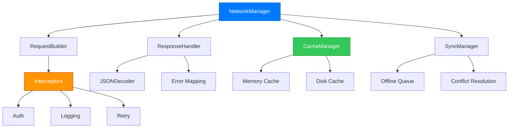

```
███╗   ██╗███████╗████████╗██╗    ██╗ ██████╗ ██████╗ ██╗  ██╗
████╗  ██║██╔════╝╚══██╔══╝██║    ██║██╔═══██╗██╔══██╗██║ ██╔╝
██╔██╗ ██║█████╗     ██║   ██║ █╗ ██║██║   ██║██████╔╝█████╔╝ 
██║╚██╗██║██╔══╝     ██║   ██║███╗██║██║   ██║██╔══██╗██╔═██╗ 
██║ ╚████║███████╗   ██║   ╚███╔███╔╝╚██████╔╝██║  ██║██║  ██╗
╚═╝  ╚═══╝╚══════╝   ╚═╝    ╚══╝╚══╝  ╚═════╝ ╚═╝  ╚═╝╚═╝  ╚═╝
```

<div align="center">

# iOS Networking Architecture Pro

**Production-ready networking layer for iOS apps**

[](https://swift.org)
[](https://developer.apple.com/ios/)
[](https://swift.org/package-manager/)
[](LICENSE)
[](https://github.com/muhittincamdali/iOS-Networking-Architecture-Pro/actions/workflows/ci.yml)

[Features](#-features) • [Installation](#-installation) • [Quick Start](#-quick-start) • [Documentation](#-documentation) • [Contributing](#-contributing)

</div>

---

## 📋 Table of Contents

- [Why This Framework?](#why-this-framework)
- [Features](#-features)
- [Architecture](#-architecture)
- [Installation](#-installation)
- [Quick Start](#-quick-start)
- [Documentation](#-documentation)
- [Contributing](#-contributing)
- [License](#license)
- [Star History](#-star-history)

---

## Why This Framework?

Built from real production experience. No bloat, no magic—just clean networking that scales from MVP to millions of users.

```swift
// That's it. Seriously.
let users: [User] = try await network.get("/users")
```

---

## ⚡ Features

| Feature | Description |
|:--------|:------------|
| **Async/Await** | Native Swift concurrency with structured error handling |
| **Multi-Level Caching** | Memory + Disk cache with configurable TTL and LRU eviction |
| **Retry Logic** | Exponential backoff with jitter for resilient requests |
| **Offline Support** | Request queuing with automatic sync when back online |
| **Interceptors** | Middleware chain for auth, logging, and custom transforms |
| **Type-Safe Builder** | Fluent API that prevents runtime errors at compile time |
| **Analytics** | Built-in request metrics and cache hit rate monitoring |

---

## 🏗️ Architecture



---

## 📊 Framework Comparison

| Feature | NetworkArchitecture Pro | Alamofire | URLSession |
|:--------|:-----------------------:|:---------:|:----------:|
| Async/Await | ✅ Native | ✅ Added | ✅ Native |
| Built-in Caching | ✅ Memory + Disk | ⚠️ Manual | ❌ None |
| Offline Queue | ✅ Built-in | ❌ None | ❌ None |
| Retry with Backoff | ✅ Configurable | ⚠️ Basic | ❌ None |
| Request Interceptors | ✅ Chain-based | ✅ Adapters | ❌ None |
| Analytics | ✅ Built-in | ❌ None | ❌ None |
| Zero Dependencies | ✅ Pure Swift | ❌ Foundation+ | ✅ Native |
| Bundle Size | ~50KB | ~180KB | 0KB |

---

## 📦 Installation

### Swift Package Manager

```swift
dependencies: [
    .package(url: "https://github.com/muhittincamdali/iOS-Networking-Architecture-Pro.git", from: "1.0.0")
]
```

### CocoaPods

```ruby
pod 'iOS-Networking-Architecture-Pro', '~> 1.0'
```

---

## 🚀 Quick Start

### 1. Configure

```swift
import NetworkingArchitecture

// One-time setup in AppDelegate or SceneDelegate
NetworkManager.shared.configure(
    baseURL: "https://api.example.com/v1",
    configuration: NetworkConfiguration(
        timeoutInterval: 30,
        retryCount: 3,
        enableCertificatePinning: true
    )
)
```

### 2. Define Your Models

```swift
struct User: Codable {
    let id: Int
    let name: String
    let email: String
}
```

### 3. Make Requests

```swift
// Simple GET
let request = APIRequest<[User]>.get("/users")
NetworkManager.shared.execute(request) { result in
    switch result {
    case .success(let users):
        print("Fetched \(users.count) users")
    case .failure(let error):
        print("Error: \(error.localizedDescription)")
    }
}

// POST with body
let createRequest = APIRequest<User>.post(
    "/users",
    body: ["name": "John", "email": "john@example.com"]
)
```

---

## 🔧 Advanced Usage

### Request Builder Pattern

```swift
let request = APIRequestBuilder<User>()
    .endpoint("/users/123")
    .method(.put)
    .header("X-Custom-Header", value: "value")
    .body([
        "name": "Updated Name",
        "email": "updated@example.com"
    ])
    .cacheTTL(3600)
    .retryCount(5)
    .timeout(60)
    .build()
```

### Custom Interceptors

```swift
class CustomAuthInterceptor: RequestInterceptor {
    func intercept(_ request: APIRequest<Any>) -> APIRequest<Any> {
        var headers = request.headers
        headers["Authorization"] = "Bearer \(TokenManager.accessToken)"
        
        return APIRequest(
            endpoint: request.endpoint,
            method: request.method,
            headers: headers,
            body: request.body
        )
    }
}

NetworkManager.shared.addInterceptor(CustomAuthInterceptor())
```

### Cache Configuration

```swift
let cacheConfig = CacheConfiguration(
    memoryCapacity: 50 * 1024 * 1024,  // 50 MB
    diskCapacity: 100 * 1024 * 1024,   // 100 MB
    ttl: 3600,                          // 1 hour
    policy: .lru,
    enableCompression: true
)

NetworkManager.shared.configureCaching(cacheConfig)
```

### Offline Support

```swift
let syncConfig = SyncConfiguration(
    enableWebSocket: true,
    syncInterval: 5.0,
    enableConflictResolution: true
)

NetworkManager.shared.enableSync(syncConfig)

// Requests made offline are automatically queued
let request = APIRequest<Order>(
    endpoint: "/orders",
    method: .post,
    body: orderData,
    shouldSync: true  // Queue for later sync
)
```

### Analytics & Monitoring

```swift
let analytics = NetworkManager.shared.getAnalytics()

print("Total Requests: \(analytics.totalRequests)")
print("Success Rate: \(Double(analytics.successfulRequests) / Double(analytics.totalRequests) * 100)%")
print("Avg Response Time: \(analytics.averageResponseTime)ms")
print("Cache Hit Rate: \(analytics.cacheHitRate * 100)%")
```

---

## 📁 Project Structure

```
Sources/
├── NetworkingArchitecture/
│   ├── NetworkManager.swift      # Core manager with singleton
│   ├── APIRequest.swift          # Request model & builder
│   └── CacheManager.swift        # Multi-level caching
├── Core/
│   └── MainFramework.swift       # Public API exports
└── iOS-Networking-Architecture-Pro.swift
```

---

## 🧪 Testing

```bash
swift test
```

Mock support included:

```swift
#if DEBUG
class MockNetworkManager: NetworkManager {
    var mockResponse: Any?
    
    override func execute<T>(_ request: APIRequest<T>, completion: @escaping (Result<T, NetworkError>) -> Void) {
        if let response = mockResponse as? T {
            completion(.success(response))
        }
    }
}
#endif
```

---

## 📚 Documentation

Full documentation available in the [Documentation](./Documentation) folder:

- [Getting Started Guide](./Documentation/GettingStarted.md)
- [API Reference](./Documentation/APIReference.md)
- [Best Practices](./Documentation/BestPractices.md)
- [Migration Guide](./Documentation/Migration.md)

---

## 🤝 Contributing

Contributions welcome! Please read [CONTRIBUTING.md](CONTRIBUTING.md) first.

1. Fork it
2. Create your feature branch (`git checkout -b feature/amazing-feature`)
3. Commit your changes (`git commit -m 'feat: add amazing feature'`)
4. Push to the branch (`git push origin feature/amazing-feature`)
5. Open a Pull Request

---

## 📄 License

MIT License - see [LICENSE](LICENSE) for details.

---

<div align="center">

**If this helped you, consider giving it a ⭐**

Built with ❤️ for the iOS community

</div>

---

## 📈 Star History

<a href="https://star-history.com/#muhittincamdali/iOS-Networking-Architecture-Pro&Date">
 <picture>
   <source media="(prefers-color-scheme: dark)" srcset="https://api.star-history.com/svg?repos=muhittincamdali/iOS-Networking-Architecture-Pro&type=Date&theme=dark" />
   <source media="(prefers-color-scheme: light)" srcset="https://api.star-history.com/svg?repos=muhittincamdali/iOS-Networking-Architecture-Pro&type=Date" />
   
 </picture>
</a>
